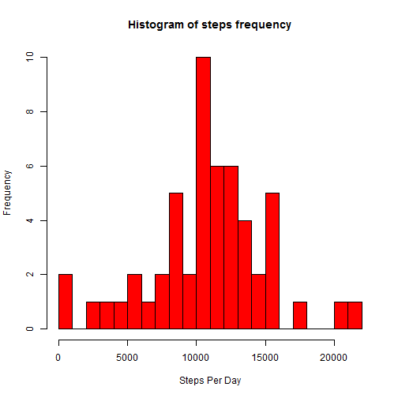
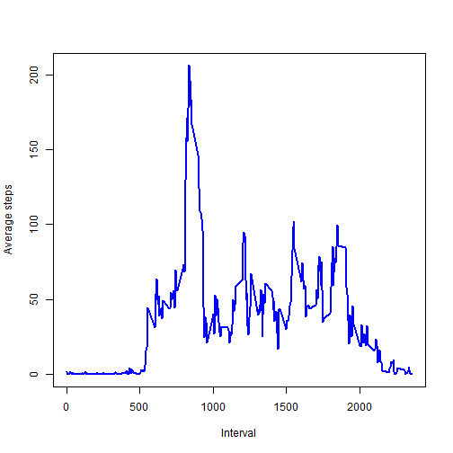
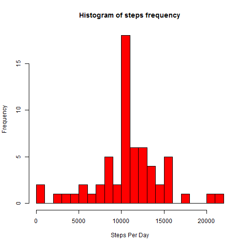
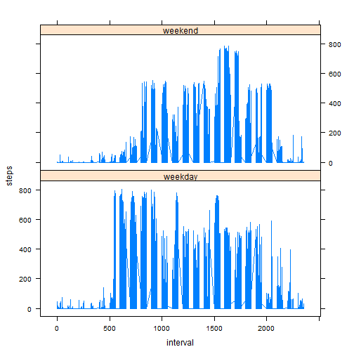

## Loading and preprocessing the data

```r
activityDF <- read.csv("activity.csv")
```

## What is mean total number of steps taken per day?

```r
stepsByDay <- aggregate(steps ~ date, activityDF, sum)
hist(stepsByDay$steps, breaks = 25, col="red", xlab="Steps Per Day", main = "Histogram of steps frequency")
```

 

```r
unadjustedMean <- mean(stepsByDay$steps)
unadjustedMedian <- median(stepsByDay$steps)
cat("Mean of steps: ", unadjustedMean)
```

```
## Mean of steps:  10766.19
```

```r
cat("Median of steps: ", unadjustedMedian)
```

```
## Median of steps:  10765
```


## What is the average daily activity pattern?

```r
stepsByInterval <- aggregate(steps ~ interval, activityDF, FUN=mean)
plot(stepsByInterval$interval, stepsByInterval$steps, type="l", col="blue", lwd=2, 
     xlab="Interval", ylab="Average steps")
```

 

## Imputing missing values

```r
cat("Number of rows with missing values: ", nrow(activityDF[is.na(activityDF$steps),]))
```

```
## Number of rows with missing values:  2304
```

```r
adjustedDF <- (merge(activityDF,stepsByInterval,by="interval"))
# filling with average per interval
adjustedDF$steps.x <- ifelse(is.na(adjustedDF$steps.x),adjustedDF$steps.y,adjustedDF$steps.x)
colnames(adjustedDF) <- c("interval","steps","date","steps2")
adjustedDF <- adjustedDF[c("interval","date","steps")]
adjustedStepsByDay <- aggregate(steps ~ date, adjustedDF, sum)
hist(adjustedStepsByDay$steps, breaks = 25, col="red", xlab="Steps Per Day", main = "Histogram of steps frequency")
```

 

```r
adjustedMean <- mean(adjustedStepsByDay$steps)
adjustedMedian <- median(adjustedStepsByDay$steps)
cat("Mean of steps, adjusted: ", adjustedMean)
```

```
## Mean of steps, adjusted:  10766.19
```

```r
cat("Median of steps, adjusted: ", adjustedMedian)
```

```
## Median of steps, adjusted:  10766.19
```

```r
cat("Difference between unadjusted and adjusted mean: ", unadjustedMean - adjustedMean)
```

```
## Difference between unadjusted and adjusted mean:  0
```

```r
cat("Difference between unadjusted and adjusted median: ", unadjustedMedian - adjustedMedian)
```

```
## Difference between unadjusted and adjusted median:  -1.188679
```

## Are there differences in activity patterns between weekdays and weekends?

```r
adjustedDF$dayType <- as.factor(ifelse(weekdays(as.Date(adjustedDF$date, "%Y-%m-%d")) 
                               %in% c("Saturday","Sunday"), "weekend", "weekday"))
library(lattice)
xyplot(steps ~ interval | factor(dayType), data=adjustedDF, type="l", layout=c(1,2))
```

 
