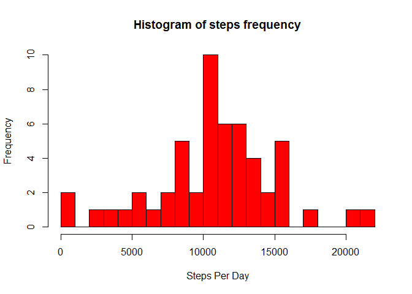

# Reproducible Research: Peer Assessment 1

```
## Warning: package 'knitr' was built under R version 3.1.3
```

## Loading and preprocessing the data

```r
activityDF <- read.csv("activity.csv")
```

## What is mean total number of steps taken per day?

```r
stepsByDay <- aggregate(steps ~ date, activityDF, sum)
hist(stepsByDay$steps, breaks = 25, col="red", xlab="Steps Per Day", main = "Histogram of steps frequency")
```

 

```r
cat("Mean of steps: ", mean(stepsByDay$steps))
```

```
## Mean of steps:  10766.19
```

```r
cat("Median of steps: ", median(stepsByDay$steps))
```

```
## Median of steps:  10765
```


## What is the average daily activity pattern?


## Imputing missing values


## Are there differences in activity patterns between weekdays and weekends?
